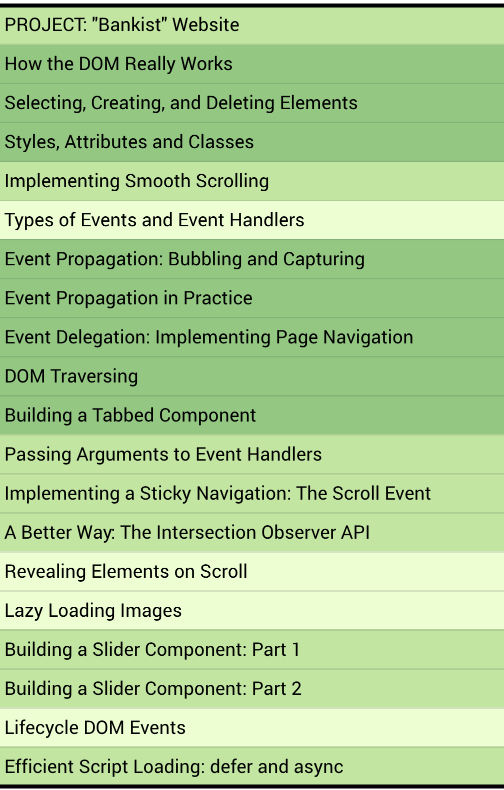

# Advanced DOM and Events

## How DOM really works?

So first, remember that the DOM is basically the interface between all JavaScript code and the browser, or more specifically HTML documents
that are rendered in and by the browser.

- Allows us to make JavaScript interact with the browser.(API)
- the DOM is a very complex Application Programming Interface that contains lots of methods and properties to interact with the DOM three.
  Such as `.quertySelector() / .addEventListener() / .createElement() / .innerHTML / .textContent / .children/  etc...`
- DOM tree is generated from an HTML documant, which we can then interact with.

## Selecting, Creating, and Deleting Elements

console.log(document.body);
console.log(document.head);
const header = document.querySelectorAll(".header");
const allSections = document.querySelectorAll(".section");
console.log(allSections);
const allButtons = document.getElementsByTagName("button");
console.log(allButtons);
console.log(document.getElementsByClassName("btn"));

const message = document.createElement("div");
message.classList.add("cookie-message");
message.textContent =
"We use cookies for improving functionality and analytics";
message.innerHTML =
'We use cookies for improving functionality and analytics <button class ="btn--close-cookie"> Got it!</button>';

header.append(message); // adds the first child of this element, or last using append

## Styles, Attributes and Classes

## Types of Events and Event Handler

[MDN JavaScript Events](https://developer.mozilla.org/en-US/docs/Web/Events)

## Roadmap

Advanced web project with dom manipulation and more events.

